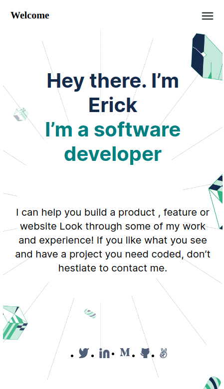

# Project Name: Erick's Portafolio

> This is the first two sections of what will be Erick's Portafolio for mobile version. 

This is the mobile version. It is responsible with use of flex and one media query for the background image.

## Built With

- Html & Css

To get a local copy up and running follow these simple example steps.

### Prerequisites: None

### Usage: Just enjoy the view =).

## Authors

👤 **Author1**

- GitHub: [@Erick-Osterling](https://github.com/Erick-Osterling)
- Twitter: [@ErickOsterling](https://twitter.com/ErickOsterling)
- LinkedIn: [@Erick Osterling Castillo](https://www.linkedin.com/in/erick-osterling-castillo-49b569104/)

## Show your support

Give a ⭐️ if you like this project!

## Acknowledgments

- Figma web
- Inspiration
- Stubbornness
